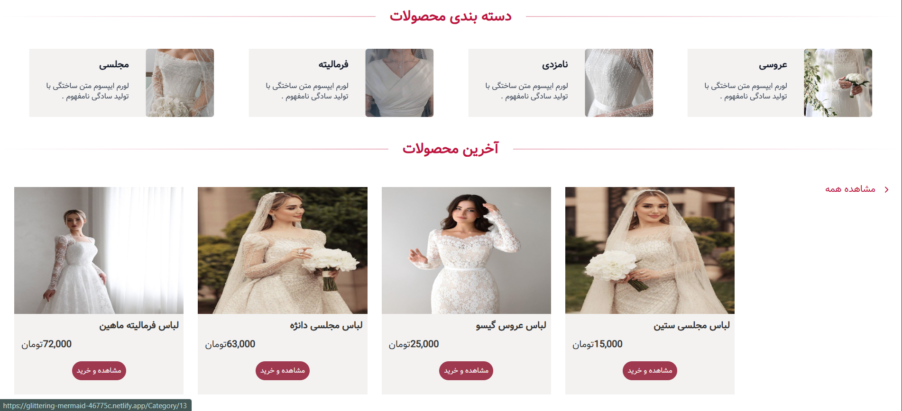
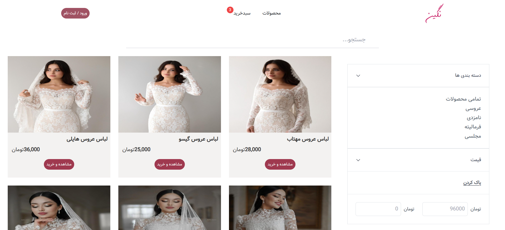
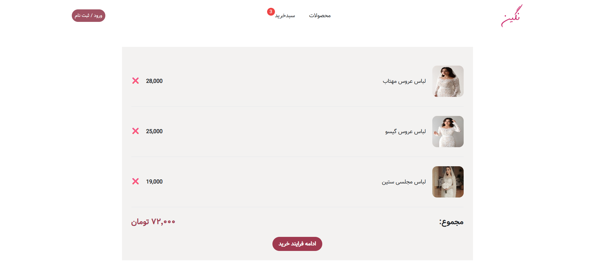

# Glittering | Bridal Dress E-Commerce Website

Glittering is a Persian, right-to-left e-commerce website designed for selling bridal dresses, engagement dresses, formal dresses, and evening dresses.  
The project is built with **React** and **Tailwind CSS** and includes product listing, product details, shopping cart, login, and registration pages.

## ✨ Features
- Fully Persian and RTL layout
- Modern bridal fashion store design
- Home page with image slider
- Product categories section
- Latest products section
- Products listing page
- Category-based filtering
- Price range filtering
- Product detail page
- Add to cart functionality
- Shopping cart page with total price calculation
- Login page
- Registration page
- Responsive UI with Tailwind CSS
- Clean and minimal user interface

## 🛠️ Technologies Used

- React
- Tailwind CSS
- JavaScript
- HTML5
- CSS3
- React Router DOM
- Formik 


## 📸 Project Screenshots

### Home Page
The home page includes a large image slider, product categories, and the latest products.


### Categories and Latest Products



### Products Page
Users can browse all products and filter them by category and price range.



### Product Detail Page
This page displays the selected product’s image, title, description, price, and an add-to-cart button.


### Shopping Cart
The cart page shows selected products, their prices, and the total cart amount.




## Available Scripts

In the project directory, you can run:

### `npm start`

Runs the app in the development mode.\
Open [http://localhost:3000](http://localhost:3000) to view it in your browser.

The page will reload when you make changes.\
You may also see any lint errors in the console.

### `npm test`

Launches the test runner in the interactive watch mode.\
See the section about [running tests](https://facebook.github.io/create-react-app/docs/running-tests) for more information.

### `npm run build`

Builds the app for production to the `build` folder.\
It correctly bundles React in production mode and optimizes the build for the best performance.

The build is minified and the filenames include the hashes.\
Your app is ready to be deployed!

See the section about [deployment](https://facebook.github.io/create-react-app/docs/deployment) for more information.


```bash
git clone https://github.com/username/project-name.git
```


### Deployment

This section has moved here: [https://facebook.github.io/create-react-app/docs/deployment](https://facebook.github.io/create-react-app/docs/deployment)


